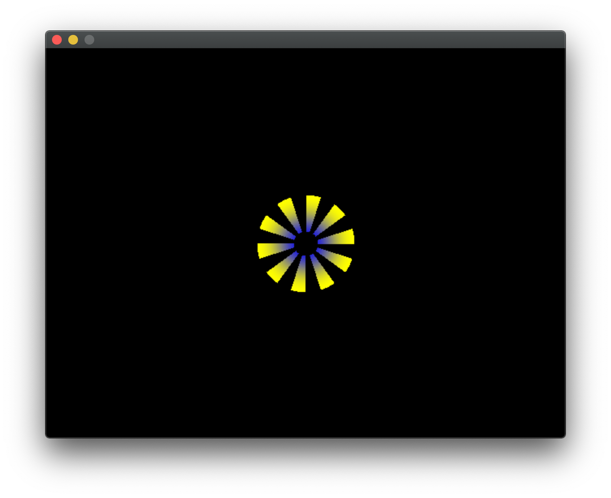

# Replicating the Functional Images Paper

In _Functional Images_ Conal Elliott presents a refreshing take on
what an image is, a _function_ from points to colors.  With this
precise semantic model we can take advantage of various laws and
typeclasses related to functions, and experiment with different kinds
of images, for instance, regions, which are functions from points to
booleans.

It's a gem of a paper, however it's been almost 20 years since the
release of the [Pan](http://conal.net/Pan/Releases/default.htm)
functional image library.  This is my attempt at reproducing the paper
using more modern libraries such as SDL2.  The project is split in the
following parts;

- `render.c` - C backend for rendering with SDL2
- `Picture.hs` - the Haskell program implementing the code from
  functional images (along with typo corrections)
- `Timing.c` - helper program to report timing information

## Requirements
- `ghc` - GHC Haskell compiler
- SDL2 library
- `make`

## Building and Running
Type `make run` to build the project and launch a window showing the
animation `mainAnim` (see `Picture.hs`).  For instance, to see Figure
19, change `mainAnim` to `mainAnim = static fig19`.  For a figure that's an
animation, for instance Figure 32, change it to `mainAnim = fig32`.

The function `calculate` performs time and coordinate normalization so
that it can be adjusted as pleased to slow down or speed up time, or
change the duration of the animation.
